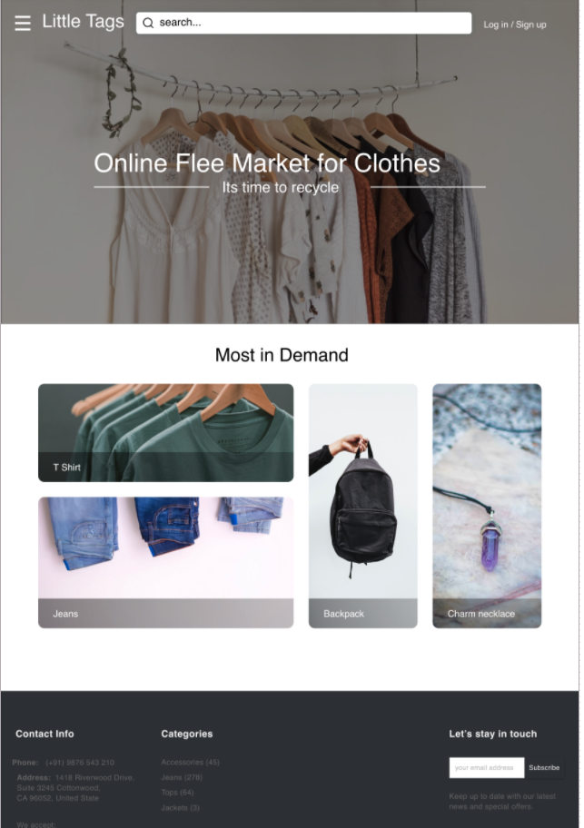
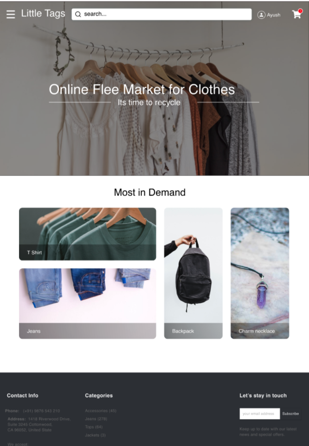
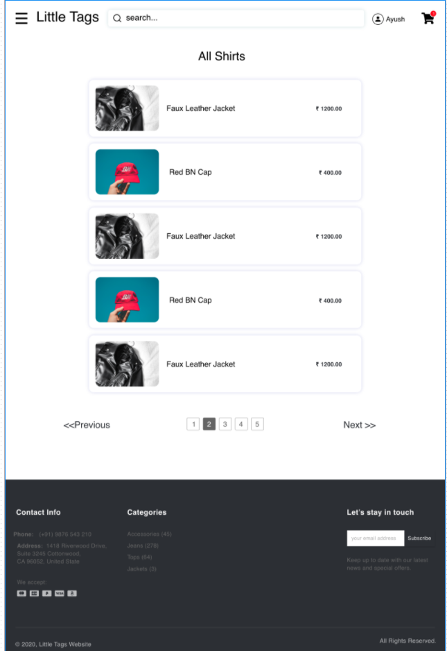
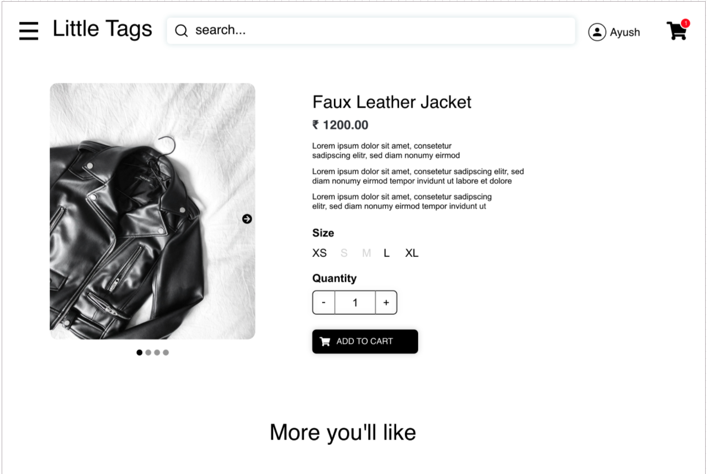
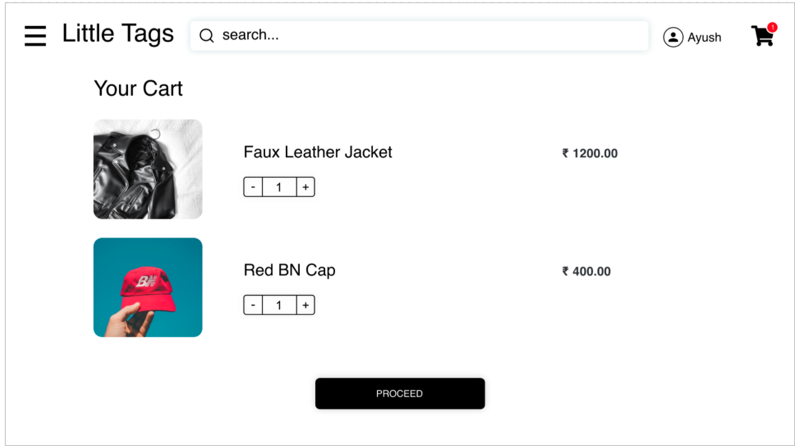
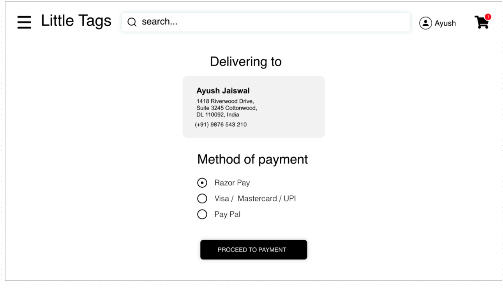
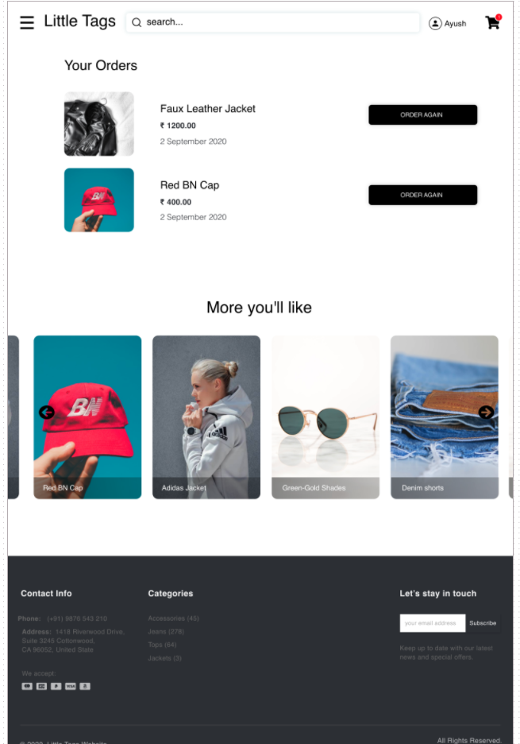
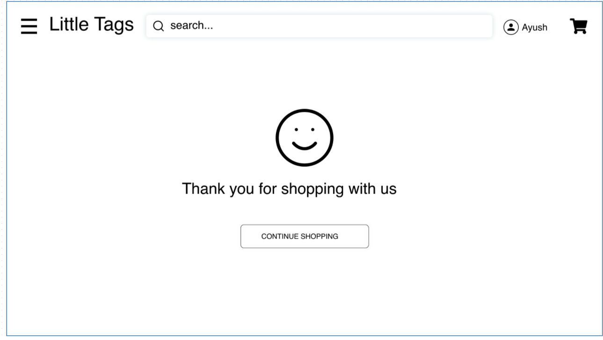

# Little Tags - An Online Clothing Store

Pesto Tech is proudly launching its own Online Clothing Store named **Little Tags**. You have been awarded with the project and you need to design and develop this project which should meet the requirements mentioned in the MVP below.

# MVP Requirement

1. Show Login/Signup popup to user when he/she lands on the site for first time.
2. User should be able to Login / Signup from the header button.
3. User should be able to Login/Signup through Google/Facebook or with their mobile numbers
4. User should be able to search items on the site using Search bar.
5. User should be able to browse items by categories mentioned on Home Page.
6. User should be able to see detailed description of an item by clicking on it. (refer design)
7. User should be able to select Size, Quantity and other parameter(if any) before adding item to the cart.
   User should be able to add and remove items in the cart.
8. Only logged in user should be able to add items to the cart.
9. Only logged in user should be able to place order.
10. User should be able to access item categories from Hamburger menu (refer design).

11. Website should be mobile responsive. user should be able to browse/purchase items on their mobile browser.
12. User should be able to see their order history.
13. User should be able to set their default shipping address.

**Note: Please deploy your application to Netlify(no other platforms allowed at this point) and Add your Application link to website section in About field**

# Bonus Requirement

1. Integrate Razorpay/Stripe Payment (sandbox environment)
2. User should be able to set default payment method
3. User should be able to add items to wishlist
4. Write Test cases for your components
5. Add multiple language support for your site. User should be able to change site language from header. all text content should be in selected language. keep `English` as default language.

## UI Design mocks

UI design mocks are available in `design-mocks` folder
Please note that UI design mocks are provided only for reference and benchmarking purpose. Design mocks doesn't cover all possible set of features in your application(for example, multiple language support). your application design **should not** be exact replica of provided mocks.

|                                    |                                        |
| :--------------------------------: | :------------------------------------: |
|          |    |
|  |           |
|          |          |
|        |  |

[Adobe XD design link](https://drive.google.com/file/d/1_e7X57CoN7YhDlapVlLkL14ksVTzAwQh/view?usp=sharing)

[Zeplin web link](https://zpl.io/a7j7MJE)

# API

Use `https://fakestoreapi.com/products` to fetch products.
You are allowed to use static data or any other third party api for fetching data.
## Allowed Tech stack(Language/Library)

- HTML, CSS, JavaScript
- Bootstrap
- ReactJS
- SCSS
- DOM Testing Library
- Jest and React Testing Library
- React Router

**NOTE: React Component libraries like Material UI, Antd, Chakra UI are not allowed**

## Implementation from Previous Pesto batches (For Inspiration and reference purpose only)

- https://stoic-bhaskara-ffe50d.netlify.app/
- https://trendz.fashion/
- https://little-tags-fe-nishantbisen09.vercel.app/
- https://little-tags-pesto.netlify.app/
- https://affectionate-jackson-ba5d1a.netlify.app/
- https://ecommerce-deep-dive.netlify.app/
- https://cocky-pare-43b620.netlify.app/#/
- https://little-tags-nikhil-gobinda.netlify.app/

Note: Your design for project should not be replica of ☝️ demos. these links are provided for inspiration purpose only.
